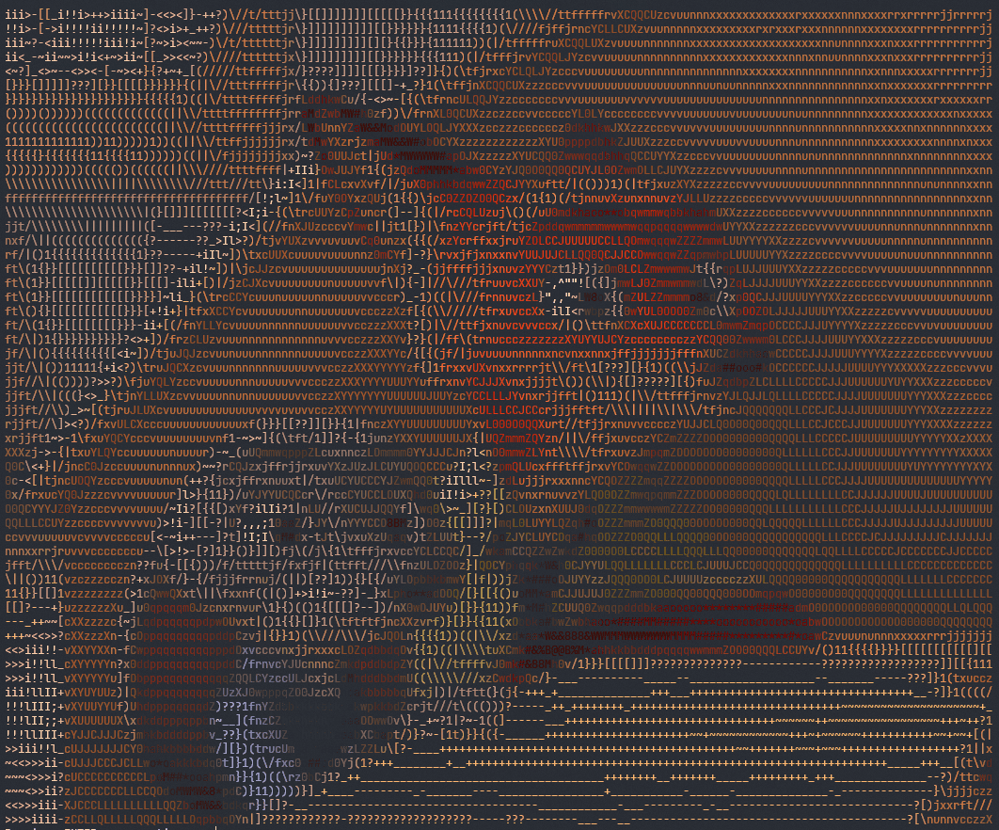

# 🎥 ASCII Generator — Modular ASCII Engine in Python

[](https://www.python.org/)
[](LICENSE)


## 📜 Overview

**ASCII Generator** is a modular-oriented Python engine that converts images, videos, and live camera feeds into expressive ASCII art. Use it for real-time terminal previews or export results as text, images, or video.

Designed for flexibility and ease of use, the project provides configurable character sets, color and grayscale modes, adjustable density/contrast, and persistent settings for reproducible output.

<p align="center">
  
  <br><br>
  <em>Interactive terminal interface with real-time preview</em>
</p>

## 🛠️ Things to fix / improve

- **[x] Fix video speed synchronization issues**: the video FPS detection was causing desync between video playback and ASCII rendering speed.
- **[x] View problems with sizing videos on exporting to file:** only change the aspect ratio, it's recommended the default settings be used for best results. (0.50f)
- **[x] Implement logger for debugging**
- [ ] Optimize performance for higher resolutions
- [ ] Add custom character sets and styles

## 📖 Table of Contents

- [✨ Features](#-features)
- [🚀 Installation](#-installation)
- [▶️ Quick Start](#quick-start)
- [📦 Dependencies](#-dependencies)
- [🎬 Examples](#-examples)
- [🤝 Contributing](#-contributing)
- [📄 License](#-license)

## ✨ Features

- Real-time image/video → ASCII conversion
- Support for **color** (truecolor/ANSI) and **grayscale** modes
- Adjustable character density, width, contrast, and brightness
- Interactive terminal menu with arrow-key navigation
- Persistent user settings (saved between sessions in `config.json`)
- Clean modular architecture — easy to extend
- Windows-friendly (includes `run.bat` launcher)
- Export ASCII art to **text** files or **images/videos**

## 🚀 Installation

Clone the repository:

```bash
git clone https://github.com/DMsuDev/ASCII_Generator.git
cd ASCII_Generator

# Recommended: create a virtual environment
python -m venv venv
venv\Scripts\activate        # Windows
# source venv/bin/activate   # Linux / macOS

# Install dependencies
pip install -r requirements.txt
```

## Quick Start

Launch the application:

```bash
# To run the CLI app
python src/main.py

# Or run with arguments, e.g.:

python src/main.py run --input path/to/video.mp4 --type video

python src/main.py run -i ./assets/examples/img.jpg -o results -t image

# For help:
python src/main.py -h  
python src/main.py run -h  
```

Alternatively (**Windows** users):

- Double-click `run.bat` (launches the packaged version)
- Or run `python test/clean.py .` first to remove **pycache** folders

Once running you can:

- Choose file (image/video) or webcam
- Adjust width, character set, color mode, speed, etc.
- Watch real-time ASCII rendering
- Save settings for next time

## 📦 Dependencies

Listed in `requirements.txt`.
Main libraries include:

- `opencv-python` — image/video processing
- `numpy` — fast array operations
- `colorama` — colored terminal output
- `readchar` — single-key input handling

**Recommended:** Python 3.11 or newer

## ✨ Examples

| RGB Camera Input                           | Grayscale ASCII                           | ASCII Conversion                                 | RGB ASCII Output                              |
| ------------------------------------------ | ----------------------------------------- | ------------------------------------------------ | --------------------------------------------- |
|  |  |  |  |

## 🤝 Contributing

Contributions are **welcome**! Whether you want to fix bugs, improve performance, add new features, or enhance the UI, feel free to open an issue or submit a pull request.

Please make sure to follow the repository's **code style** and **documentation conventions**.

We appreciate your contributions and feedback! 🙌

## 📝 License

ASCII Generator is licensed under the MIT License.  
See the [LICENSE](LICENSE) file for more details.

[](LICENSE)

by DMsuDev © 2026
