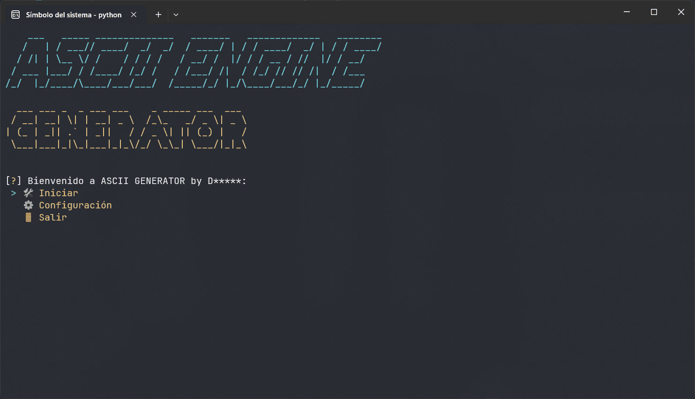
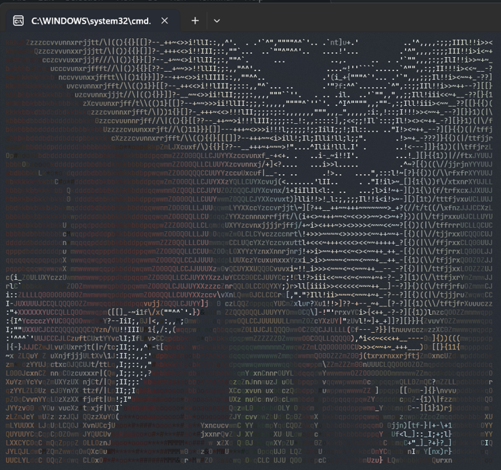
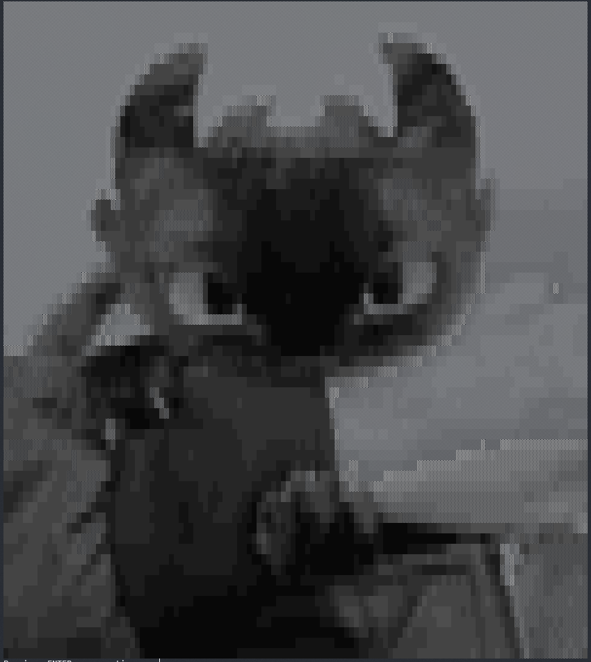
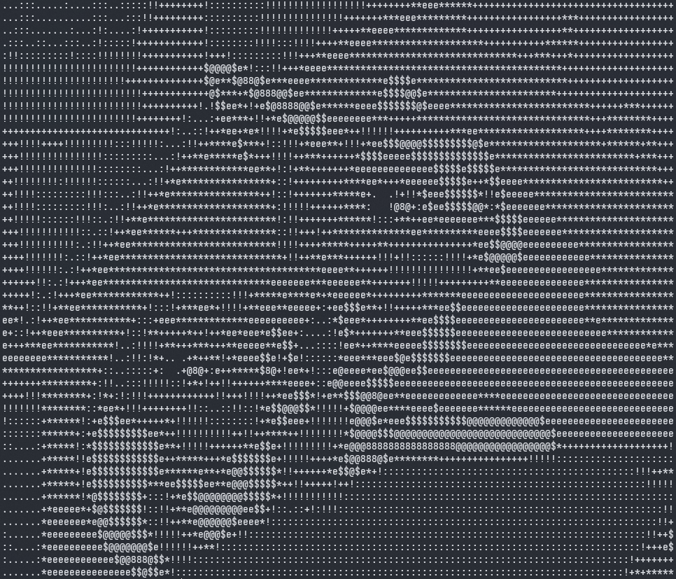
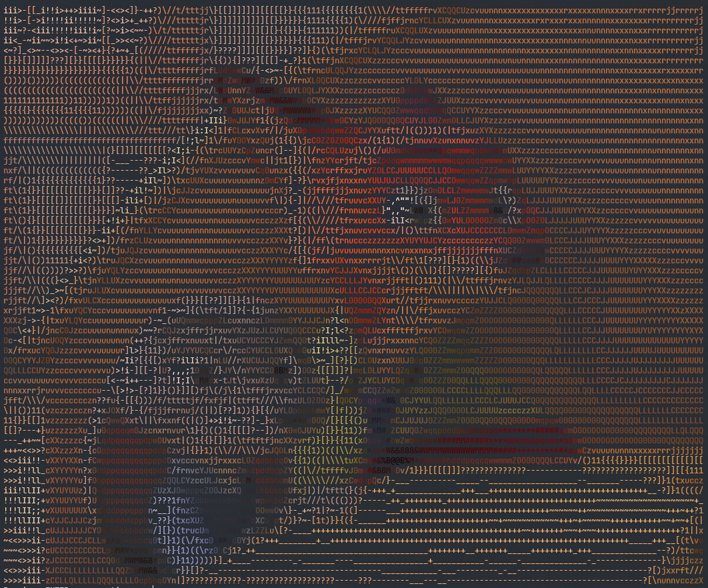

# 🎥 ASCII Generator — Modular ASCII Engine in Python

[](https://www.python.org/)
[](LICENSE)


One of my most recent projects! I was literally bored and decided to explore the world of ASCII art, which inspired this project.

<p align="center">
  
</p>

ASCII Generator allows you to convert images and videos into ASCII art in a modular, interactive, and fully configurable way.

## 📑 Table of Contents

- [🚀 Installation](#-installation)
- [▶️ Usage](#usage)
- [📦 Dependencies](#-dependencies)
- [✨ Examples](#-examples)
- [🤝 Contributions](#-contributions)
- [📝 License](#-license)

## 🚀 Installation

Clone the repository:

```bash
git clone https://github.com/DMsuDev/ASCII_Generator.git
cd ASCII_Generator
```

Install the dependencies:

```cmd
pip install -r requirements.txt
```

## Usage

Run the main program:

```cmd
python app.py
```

From there you can:

- Select an image or video file
- Adjust parameters (width, density, color, speed…)
- Start real-time ASCII conversion
- Navigate dynamic menus and persistent settings

## 📦 Dependencies

The following dependencies are required to run this project:

| Package        | Version / Notes                         |
| -------------- | --------------------------------------- |
| **Python**     | 3.11.0 or 3.12.0                        |
| **OpenCV**     | 4.12.0.88                               |
| **NumPy**      | 2.2.x (compatible with OpenCV)          |
| **readchar**   | Latest stable                           |
| **Colorama**   | Latest stable                           |
| **InquirerPy** | Latest stable (CLI menus, optional)     |
| **PyFiglet**   | Latest stable (ASCII banners, optional) |

## ✨ Examples

| RGB Camera Input                       | Grayscale ASCII                       | ASCII Conversion                             | RGB ASCII Output                          |
| -------------------------------------- | ------------------------------------- | -------------------------------------------- | ----------------------------------------- |
|  |  |  |  |

## 🤝 Contributions

Contributions are **welcome**! Whether you want to fix bugs, improve performance, add new features, or enhance the UI, feel free to open an issue or submit a pull request.

Please make sure to follow the repository's **code style** and **documentation conventions**.

We appreciate your contributions and feedback! 🙌

## 📝 License

MFOG is licensed under the MIT License.  
See the [LICENSE](LICENSE) file for more details.

[](LICENSE)
